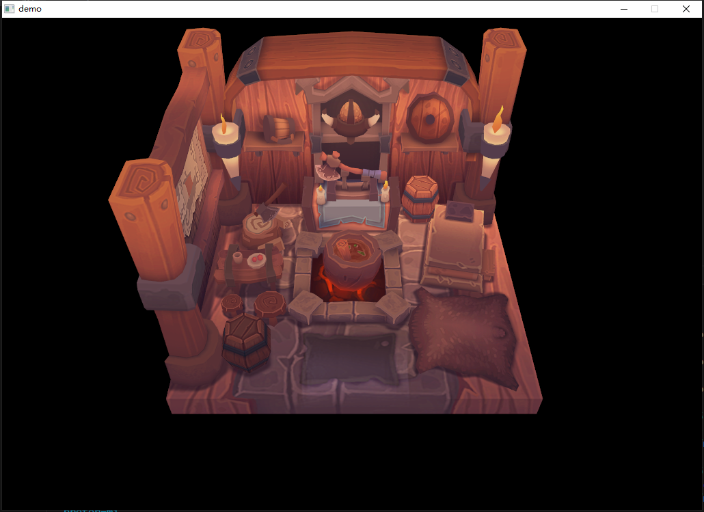
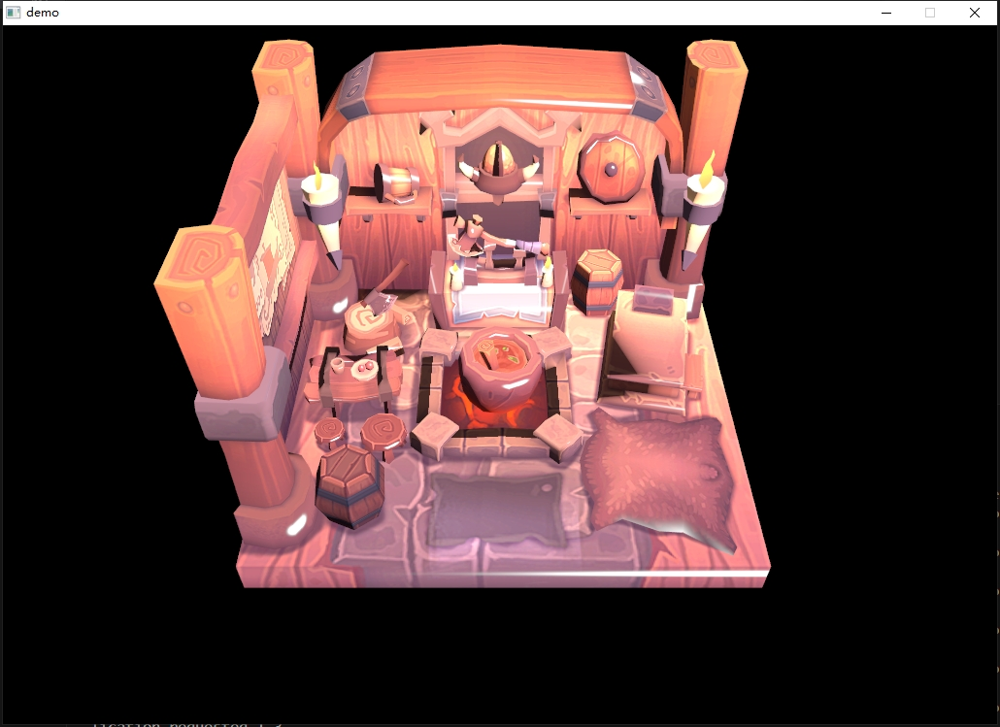

# skToyRenderer

基于 Vulkan 的简易渲染器

内容参考了[Vulkan 官方教程](https://vulkan-tutorial.com/)，API 参考了[Toy2D 项目](https://github.com/VisualGMQ/toy2d)

目前只完成了 3D 中加载.obj 模型的部分，后续还会尝试加入光源等效果。

也会考虑把[Toy2D](https://github.com/VisualGMQ/toy2d)的 2D API 也移植过来。

## 编译运行方式

确保安装了 Vulkan SDK。

项目基于 CMake，我使用的是 VSCode 的插件。

需要配置 SDL、Vulkan、Tiny_obj 的依赖位置：

```json
// .vscode/settings.json
{
  "cmake.configureArgs": [
    "-DSDL2_ROOT=<your SDL path>",
    "-DSDL2_IMAGE_ROOT=<your SDL_IMAGE path>",
    "-DVULKAN_DIR=<your Vulkan path>",
    "-DTINY_OBJECT_DIR=<your Tiny_Object path>"
  ]
}
```

## 编译结果

`sktr`是编译得到的 library，`demo`是一个可执行的例子。

在`demo`中使用以下代码可以直接引入`sktr`的依赖：

```C
target_link_libraries(${DemoName} PRIVATE sktr)
```

## demo 运行效果

1. branch 0.0.1_base
   

2. branch 0.0.2_blinn-phong
   

## 更新日志

- [x] 2023 年 10 月 20 日：基础模型加载
- [x] 2023 年 11 月 12 日：布林冯着色模型
- [ ] 软阴影
